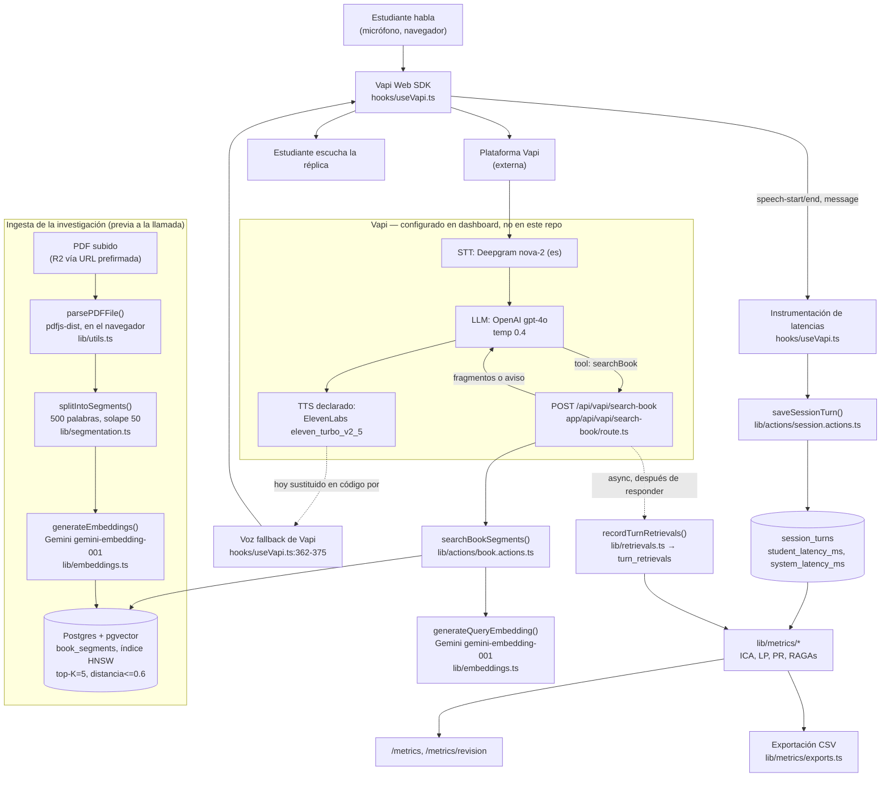

# Auditoría técnica del repositorio — evidencia para el capítulo de resultados

> Revisión de solo lectura, sin modificar código y sin consultar ninguna base de datos (la
> base de datos accesible desde el entorno de esta revisión es distinta de la de producción).
> Todo lo que sigue está anclado a archivos concretos del repositorio; donde no hay evidencia,
> se dice explícitamente en vez de inventarla.

## 0. Versión revisada

- **Commit:** `b589501123ef1359da610f2d8962f3f709c1d4e3`
- **Fecha del commit:** 2026-09-10T23:20:21-05:00
- **Mensaje:** `mas fix`
- **Rama:** `main`
- **Árbol de trabajo:** limpio (`git status` sin cambios pendientes) en el momento de esta revisión.

---

## 1. Arquitectura real, de extremo a extremo (voz → voz)

```
Estudiante habla
   │
   ▼
Vapi Web SDK (@vapi-ai/web) en el navegador — hooks/useVapi.ts
   │  captura audio, hace de transporte hacia Vapi
   ▼
Vapi (plataforma externa)
   ├─ STT: Deepgram nova-2, language:"es" — configurado en el dashboard de Vapi,
   │        referencia versionada en docs/agente/vapi-config.md (no está en el repo)
   ├─ LLM: OpenAI gpt-4o, temperature 0.4, maxTokens 250 — mismo lugar
   │        └─ el LLM decide invocar el tool "searchBook" antes de preguntar
   │             │
   │             ▼
   │        POST /api/vapi/search-book (app/api/vapi/search-book/route.ts)
   │             │
   │             ▼
   │        searchBookSegments() (lib/actions/book.actions.ts:207)
   │             ├─ embebe la consulta: generateQueryEmbedding() (lib/embeddings.ts:45, Gemini gemini-embedding-001)
   │             ├─ busca en Postgres+pgvector por distancia coseno (book_segments, índice HNSW)
   │             └─ filtra por RETRIEVER_MAX_DISTANCE (0.6) y corta en RETRIEVER_TOP_K (5)
   │             │
   │             └─ texto de los fragmentos ⇒ de vuelta al LLM como resultado del tool
   │        (en paralelo, after(): registra la recuperación en turn_retrievals — lib/retrievals.ts)
   │
   └─ TTS: la configuración documentada dice ElevenLabs eleven_turbo_v2_5, pero el código que
            realmente corre hoy (hooks/useVapi.ts:365-375) fuerza `provider: 'vapi', voiceId: 'Clara'`
            — ver limitación en el punto 10.
   │
   ▼
Audio de vuelta al navegador (Vapi Web SDK)
   │
   ▼
Eventos del SDK (speech-start/speech-end/message) → useVapi.ts calcula latencias y
persiste cada turno cerrado con saveSessionTurn() (lib/actions/session.actions.ts:125)
```

Todo el tramo STT→LLM→TTS ocurre **dentro de la plataforma Vapi**, no en este repositorio. Lo
que el repo controla directamente es: el inicio/fin de la llamada, el tool de recuperación, y el
registro de turnos y latencias.

---

## 2. Tecnologías, proveedores, modelos y bases de datos efectivamente usados

| Capa | Tecnología / proveedor | Modelo / versión | Evidencia |
|---|---|---|---|
| Framework | Next.js 16 (App Router) + React 19 + TypeScript | `next@16.1.6`, `react@19.2.3` | `package.json` |
| Voz (orquestación) | Vapi Web SDK | `@vapi-ai/web@^2.7.0` | `package.json:20` |
| STT | Deepgram (vía Vapi) | `nova-2`, `language: "es"` | `docs/agente/vapi-config.md:60-71` — **configurado en dashboard, no en código** |
| LLM conversacional | OpenAI (vía Vapi) | `gpt-4o`, temp 0.4, maxTokens 250 | `docs/agente/vapi-config.md:29-38` — **configurado en dashboard, no en código** |
| TTS declarado | ElevenLabs (vía Vapi) | `eleven_turbo_v2_5` | `docs/agente/vapi-config.md:75-92` |
| TTS realmente activo hoy | Voz propia de Vapi (fallback) | `voiceId: 'Clara'` | `lib/constants.ts:52-65`, `hooks/useVapi.ts:362-375` |
| Embeddings | Google Gemini | `gemini-embedding-001`, 768 dimensiones | `lib/embeddings.ts:11-13` |
| Juez de RAGAs | Google Gemini | `gemini-2.5-flash` (por defecto), temperatura 0 | `lib/metrics/judge.ts:17-21` |
| Base de datos relacional + vectorial | PostgreSQL + pgvector | ORM Drizzle `^0.45.2`, índice HNSW coseno | `database/schema/bookSegments.ts`, `database/db.ts` |
| Auth | Better Auth | `better-auth@^1.6.9` | `lib/auth.ts`, `lib/session.ts` |
| Almacenamiento de archivos | Cloudflare R2 (S3-compatible) | `@aws-sdk/client-s3` con presigned URLs | `lib/r2.ts` |
| Parseo de PDF | `pdfjs-dist` — **en el navegador**, no en el servidor | `^5.4.624` | `lib/utils.ts:59-99` |
| UI | Tailwind v4 + shadcn/ui + sonner | — | `package.json` |

---

## 3. Módulos y funcionalidades actualmente implementados

Confirmados por código en ejecución (no solo declarados):

- Autenticación y sesión (Better Auth).
- Carga de investigación (PDF + portada) vía URL prefirmada a R2: `app/api/upload/route.ts`.
- Ingesta: parseo de PDF en cliente, segmentación, generación de embeddings, guardado —
  `lib/actions/book.actions.ts` (`createBook`, `saveBookSegments`).
- Sesión de voz completa: inicio, llamada a Vapi, vínculo con `vapiCallId`, fin y duración —
  `lib/actions/session.actions.ts`, `hooks/useVapi.ts`.
- Webhook de recuperación (`searchBook`) con registro de evidencia —
  `app/api/vapi/search-book/route.ts`, `lib/retrievals.ts`.
- Registro de turnos con latencias de sistema y del estudiante en tiempo real —
  `hooks/useVapi.ts` + `session.actions.ts`.
- Historial de conversaciones por usuario y detalle por sesión (transcripción, retrievals,
  RAGAs, costo de Vapi) — `app/(root)/history/`.
- Panel de métricas (`/metrics`) con ICA, LP, latencia del estudiante, PR, RAGAs.
- Revisión humana de respuestas (`/metrics/revision`) con guardado de veredicto.
- Cálculo de RAGAs bajo demanda (por lotes de 10 ternas) con caché en BD.
- Exportación a CSV (3 archivos: turnos, sesiones, participantes).
- Encuestas de instrumentos de investigación (STAI, PRCS-12, SUS) con validación y cálculo de
  puntaje — `lib/surveys.test.mts`, `app/(root)/surveys/`, `lib/actions/survey.actions.ts`,
  tabla `survey_responses`.
- Control de acceso por allowlist de correo para las pantallas de métricas —
  `lib/metrics/access.ts` (falla cerrado si `METRICS_OWNER_EMAILS` no está definido).

No se revisó el módulo de suscripciones/facturación en detalle porque `CLAUDE.md` indica que es
andamiaje heredado, irrelevante para la investigación, y no debe tocarse.

---

## 4. Flujo RAG real

1. **Carga:** el estudiante sube un PDF (máx. 50 MB) a R2 vía URL prefirmada
   (`app/api/upload/route.ts`).
2. **Extracción de texto:** ocurre **en el navegador** con `pdfjs-dist`, página por página,
   conservando el número de página (`lib/utils.ts:59-99`). **Limitación real:** si el PDF es una
   imagen escaneada sin capa de texto, no hay OCR y se generan cero segmentos.
3. **Fragmentación:** ventana de 500 palabras con solape de 50 palabras, sobre el flujo de
   palabras de todas las páginas; cada segmento se atribuye a la página donde **empieza** —
   `lib/segmentation.ts:9-71` (`splitIntoSegments`), con 6 pruebas unitarias pasando (ver
   sección 6).
4. **Embeddings:** Gemini `gemini-embedding-001`, 768 dimensiones, en lotes de 100 —
   `lib/embeddings.ts:35-43` (`generateEmbeddings`, para documentos) y `generateQueryEmbedding`
   (para consultas, con `taskType: RETRIEVAL_QUERY`).
5. **Guardado:** segmentos + embeddings en `book_segments` (pgvector), dentro de una transacción
   que también actualiza `books.totalSegments` — `lib/actions/book.actions.ts:158-201`.
6. **Recuperación:** el LLM (en Vapi) invoca `searchBook`; la ruta ejecuta
   `searchBookSegments()`, que calcula distancia coseno vía índice HNSW, corta en `top_k = 5` y
   descarta lo que exceda `distancia máxima = 0.6` — `lib/actions/book.actions.ts:207-250`,
   parámetros en `lib/constants.ts:105-124`.
7. **Registro de evidencia:** después de responder al webhook (para no penalizar latencia), se
   guarda cada fragmento devuelto con su rango y distancia en `turn_retrievals` —
   `lib/retrievals.ts`.
8. **Generación:** el LLM (gpt-4o, vía Vapi) recibe el texto de los fragmentos como resultado del
   tool y genera la réplica anclada.
9. **Respuesta por voz:** TTS sintetiza la réplica (ver discrepancia ElevenLabs/voz fallback en
   la sección 10) y Vapi la transmite de vuelta al navegador.

**Umbral de distancia (0.6) marcado explícitamente como `PROVISIONAL` en el código** — no
calibrado empíricamente porque, según el propio comentario, "la base de datos está vacía"
(`lib/constants.ts:118-124`).

---

## 5. Tabla de componentes — estado real

| Componente | Estado | Evidencia |
|---|---|---|
| STT (Deepgram nova-2, es) | **Implementado**, pero configurado a mano en el dashboard de Vapi, no reproducible por API | `docs/agente/vapi-config.md`, `hooks/useVapi.ts` |
| LLM (gpt-4o) | **Implementado**, mismo caveat que STT | `docs/agente/vapi-config.md` |
| Base de datos vectorial (pgvector+HNSW) | **Implementado** | `database/schema/bookSegments.ts` |
| Retriever (top-K + umbral) | **Implementado**, umbral **provisional** (no calibrado) | `lib/actions/book.actions.ts`, `lib/constants.ts:118-124` |
| TTS | **Parcial / discrepancia**: documentado como ElevenLabs, pero el código activo usa la voz propia de Vapi | `lib/constants.ts:52-65`, `hooks/useVapi.ts:362-375` |
| Ingesta de PDF | **Implementado**, sin OCR (parcial ante PDFs escaneados) | `lib/utils.ts` |
| Registro de turnos y latencias | **Implementado** | `hooks/useVapi.ts`, `lib/actions/session.actions.ts` |
| Registro de recuperaciones | **Implementado**, con degradación conocida: si `sessionId` no llega desde Vapi, la recuperación no se persiste | `app/api/vapi/search-book/route.ts:65-77` |
| Autenticación de webhook (`VAPI_SERVER_SECRET`) | **Pendiente / declarado, no implementado** — la variable existe pero la ruta no valida la cabecera | `docs/agente/vapi-config.md:188`, `docs/arquitectura.md:406` |
| ICA | **Implementado como índice declarativo**, no medido dinámicamente contra tráfico real | `lib/metrics/architecture.ts` |
| PR | **Implementado**, requiere revisión humana manual (no hay clasificador automático) | `lib/metrics/precision.ts`, `components/metrics/TurnReviewList.tsx` |
| RAGAs (4 sub-métricas) | **Implementado como adaptación TypeScript**, bajo demanda (no automático/continuo), no es la librería oficial | `lib/metrics/ragas.ts:1-52` |
| Exportación CSV | **Implementado** | `lib/metrics/exports.ts` |
| Encuestas STAI/PRCS-12/SUS | **Implementado**, aplicación de las encuestas fuera de la app según el diseño | `lib/surveys.test.mts`, `database/schema/surveyResponses.ts` |
| Código de participante / grupo de estudio | **Parcial**: campos existen en el esquema, pero la asignación es manual en BD | `database/schema/auth.ts:10-11` |

---

## 6. Pruebas existentes y resultados reales

Ejecutado `npm test` (`node --test` sobre `lib/*.test.mts`) sobre el commit citado en la
sección 0:

```
lib/segmentation.test.mts
lib/metrics.test.mts
lib/surveys.test.mts

tests 57
suites 11
pass 57
fail 0
cancelled 0
skipped 0
todo 0
duration_ms 648.99
```

Cubren: `computeIca`, `summarizeLatency`, `numberSessionsByParticipant`,
`summarizeByParticipantSession`, `computePrecision`, `buildRagasTriples`, helpers puros de
RAGAs, `computeRagasForTriple` (con juez simulado, no real), `toCsv`, formateo,
`splitIntoSegments`, y los tres instrumentos de encuesta (STAI, PRCS-12, SUS).

**No hay pruebas de integración, end-to-end, ni pruebas contra la base de datos real, ni pruebas
del webhook de Vapi, ni de la UI.** Todo lo probado son funciones puras de `lib/metrics/` y
`lib/segmentation.ts`. Esto es consistente con `CLAUDE.md` ("No hay tests en el proyecto [de
integración]. Si agregas lógica pura... agrega tests para esa lógica").

---

## 7. Cantidad actual de sesiones, turnos y evaluaciones almacenadas

**No verificable en esta revisión.** Por indicación explícita del responsable de esta auditoría
no se consultó ninguna base de datos, y la base de datos accesible desde este entorno es
distinta de la de producción. No hay ningún archivo en el repositorio que registre snapshots de
conteos reales. Cualquier cifra aquí sería inventada — no se reporta.

---

## 8. Valores actuales de ICA, latencia, precisión y métricas RAG

- **ICA:** con los 5 componentes marcados `integrated: true` en el registro declarativo, el
  cálculo da **100 %** (`Ci = 5, Ct = 5`) — esto es un resultado de la fórmula sobre datos de
  configuración estática, verificable leyendo `lib/metrics/architecture.ts:33-74`, **no depende
  de tráfico real**.
- **LP, latencia del estudiante, PR, RAGAs:** todos se calculan a partir de filas en
  `session_turns`, `turn_evaluations` y `ragas_evaluations`. No se consultaron esas tablas
  (sección 7). El propio código está diseñado para que, sin datos, cada métrica reporte
  `null`/vacío en vez de cero o un valor inventado (`lib/metrics/format.ts`,
  `EMPTY_LATENCY_SUMMARY`, etc.), y la UI de `/metrics` lo dice explícitamente: "una métrica sin
  datos se muestra vacía, nunca en cero" (`app/(root)/metrics/page.tsx:57-58`).
- No hay forma de distinguir en el esquema actual "datos de prueba" de "datos de demostración" de
  "datos reales" — no existe ninguna columna o flag de entorno/origen en `voice_sessions` ni
  `session_turns`. Esa distinción tendría que hacerse externamente (por ejemplo, por rango de
  fechas o por `participantCode` asignado vs. nulo), no por el software.

---

## 9. Funcionalidades de historial, revisión, métricas y exportación

- **Guardar historial:** cada turno se persiste en vivo, no al cerrar la llamada, para que un
  cierre de pestaña no pierda evidencia — `hooks/useVapi.ts:88-121` + `saveSessionTurn`
  (`lib/actions/session.actions.ts:125`). Listado en `app/(root)/history/page.tsx`, detalle en
  `app/(root)/history/[sessionId]/page.tsx` (incluye transcripción, retrievals, evaluaciones
  humanas, RAGAs y costo/duración reportados por Vapi).
- **Revisar respuestas:** `/metrics/revision`, con `TurnReviewList` — marcar correcta/incorrecta,
  nota opcional, deshacer veredicto; un veredicto por turno (`onConflictDoUpdate` sobre
  `turn_evaluations.turn_id`).
- **Visualizar métricas:** `/metrics`, protegido por allowlist de correo
  (`lib/metrics/access.ts`, falla cerrado sin `METRICS_OWNER_EMAILS`).
- **Exportar CSV:** tres archivos (`metricas-turnos.csv`, `metricas-sesiones.csv`,
  `metricas-participantes.csv`), UTF-8, separador coma, con `codigo_participante` para cruzar
  con encuestas externas — `lib/metrics/exports.ts`.

Todas estas cuatro funcionalidades están efectivamente implementadas y conectadas a rutas
reales, no solo declaradas.

---

## 10. Limitaciones técnicas y elementos declarados pero no verificados dinámicamente

1. **La configuración del agente (prompt, modelo, STT, tools, turn-taking) vive en el dashboard
   de Vapi, no en el repo.** `docs/agente/` es una copia versionada auditable, pero nada
   garantiza que coincida con lo que hoy está aplicado en el dashboard — el propio checklist de
   aplicación en `docs/agente/vapi-config.md:204-214` está **con todos los ítems sin marcar** en
   el repo, incluida la línea "Sesión de prueba corrida y checklist... verificada". Es decir: no
   hay evidencia en el repositorio de que esta configuración se haya aplicado ni probado en vivo.
2. **Discrepancia TTS:** la documentación describe ElevenLabs `eleven_turbo_v2_5` como el
   sintetizador, pero el código que corre hoy en `hooks/useVapi.ts:362-375` fuerza la voz propia
   de Vapi (`provider: 'vapi', voiceId: 'Clara'`), con un comentario explícito de que es un
   *fallback* mientras ElevenLabs no esté conectado en el dashboard, y una advertencia de que esa
   voz "lee el texto en español con acento anglófono" — "aceptable para una prueba de humo, NO
   para las sesiones del estudio" (`lib/constants.ts:57-62`).
3. **El webhook `/api/vapi/search-book` no valida `VAPI_SERVER_SECRET`**, aunque la variable
   existe en `.env`. Cualquiera que conozca la URL y un `bookId` podría consultar fragmentos del
   documento sin autenticación. Declarado como deuda de seguridad conocida en
   `docs/arquitectura.md:406`.
4. **El umbral del retriever (`RETRIEVER_MAX_DISTANCE = 0.6`) es provisional**, razonado pero no
   calibrado contra un documento real, según el propio comentario en `lib/constants.ts:118-124`.
5. **RAGAs es una adaptación en TypeScript**, no la librería oficial `ragas` de Python. Dos de
   las cuatro sub-métricas (context precision, context recall) se desvían conceptualmente del
   cálculo original por ausencia de `ground_truth` anotado — declarado extensamente en
   `lib/metrics/ragas.ts:1-52`.
6. **ICA es un índice autodeclarado**, no una medición contra tráfico en vivo: si un componente
   deja de funcionar mientras el flag `integrated` sigue en `true`, el ICA seguirá reportando el
   mismo porcentaje.
7. **Sin OCR:** un PDF escaneado sin capa de texto produce cero segmentos; el documento se sube
   pero el agente no tiene nada donde anclarse.
8. **La extracción de texto no distingue estructura** (tablas, fórmulas, encabezados caen como
   texto corrido).
9. **La recuperación no queda registrada si `sessionId` no llega** desde el tool call de Vapi —
   el buscador funciona igual para el estudiante, pero esa consulta no entra al cálculo de RAGAs.
10. **`recomputeRagas` procesa como máximo 10 ternas por invocación** (limitación de timeout), no
    es un proceso continuo ni automático.
11. **La asignación de `participantCode` y `studyGroup` es manual en base de datos**, no hay UI
    para ello.
12. No existe, en ningún archivo revisado, un mecanismo que distinga sesiones de prueba/demo de
    sesiones de participantes reales del estudio.

---

## 11. Diagrama de arquitectura real



---

## Resumen de lo no verificable en esta revisión

Por diseño de esta auditoría (solo lectura, sin acceso a la base de datos de producción): no se
reportan cifras de sesiones, turnos, evaluaciones humanas ni valores numéricos reales de
LP/PR/RAGAs (secciones 7 y 8). Todo lo demás en este documento está anclado a código y
documentación versionada en el commit citado en la sección 0, con la ruta de archivo como
evidencia verificable.
