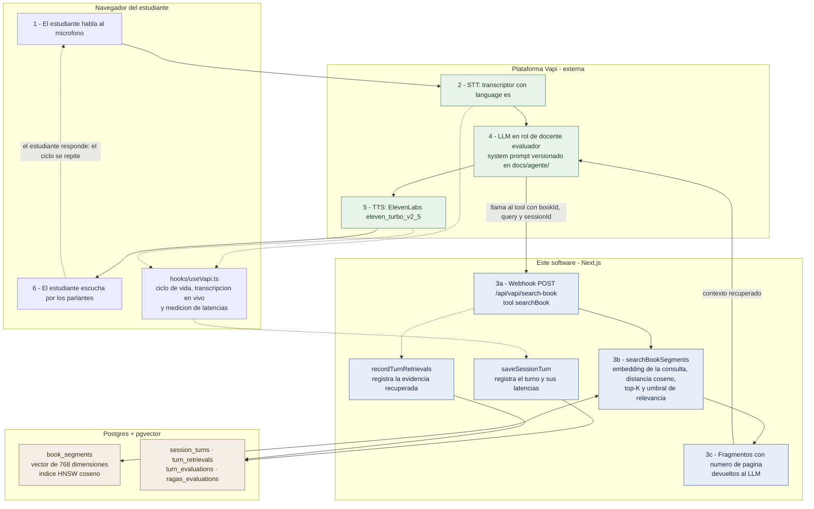

# Arquitectura del artefacto y evidencia del ICA

**Proyecto:** Agente conversacional por voz con RAG para la simulación de sustentaciones de
avances de investigación
**Institución:** Universidad Nacional de Trujillo, 2026
**Fecha de este documento:** 2026-09-04
**Última verificación contra el código y la base de datos:** 2026-09-04

> Este documento describe **lo que el software hace hoy**, no lo que se planeó que hiciera.
> Cada afirmación apunta a un archivo del repositorio que el lector puede abrir para
> comprobarla. Donde una medición todavía no existe, se dice que no existe: no hay valores
> estimados ni "esperados" en este documento.

---

## 1. Qué es el sistema

El estudiante sube su avance de investigación en PDF. El sistema lo segmenta, lo vectoriza y
lo guarda. Después, el estudiante inicia una sesión de voz con un agente que asume el rol de
**docente evaluador de un jurado de sustentación**: le hace preguntas, y cada pregunta está
anclada en fragmentos recuperados de su propio documento, no en el conocimiento general del
modelo.

Son dos flujos distintos y conviene no confundirlos:

- **Ingesta** (una vez por documento): PDF → texto por páginas → segmentos → embeddings →
  Postgres/pgvector.
- **Sustentación** (repetida y síncrona): voz → STT → recuperación → LLM → TTS → voz.

El segundo es el flujo funcional que la investigación declara como obligatorio, y es el que se
diagrama abajo.

---

## 2. Diagrama del flujo funcional

### 2.1 Qué corre dónde

La primera pregunta razonable de un jurado es cuánto del sistema es código propio y cuánto es
un servicio de terceros. La respuesta, dicha por adelantado:

| Capa | Dónde corre | Por qué |
|---|---|---|
| STT, LLM, TTS y turn-taking | **Vapi** (plataforma externa) | Es la tecnología presupuestada en la investigación (Tabla 6 y Tabla 12). Delegar el pipeline de voz a un servicio especializado es una decisión de arquitectura, no una carencia: la voz en tiempo real exige infraestructura de streaming que no es el objeto de esta investigación. |
| Base vectorial, retriever, instrumentación y métricas | **Este software** | Es el aporte propio: el anclaje de las preguntas al documento del estudiante y toda la evidencia medible del capítulo de resultados. |

Dicho de otro modo: **Vapi aporta la voz; este repositorio aporta el anclaje documental y la
medición.** Sin el webhook de este repositorio, el agente de Vapi sería un LLM conversacional
genérico, incapaz de citar la investigación del estudiante.

### 2.2 El ciclo de la sustentación



### 2.3 Los cinco pasos, uno por uno

1. **El estudiante habla → STT transcribe.** El audio va del navegador a Vapi por WebRTC. El
   transcriptor está fijado en `language: "es"` (ver [docs/agente/vapi-config.md](agente/vapi-config.md)):
   no es autodetección, es una restricción declarada de la investigación.
2. **El texto se enriquece con fragmentos del documento del estudiante.** El system prompt
   obliga al LLM a invocar el tool `searchBook` **antes** de formular cualquier pregunta sobre
   el contenido. Vapi hace `POST` a `/api/vapi/search-book` con `bookId`, `query` y `sessionId`.
   La ruta embebe la consulta con Gemini (`RETRIEVAL_QUERY`), busca por distancia coseno sobre
   `book_segments`, se queda con los `RETRIEVER_TOP_K = 5` vecinos más cercanos, descarta los
   que superan `RETRIEVER_MAX_DISTANCE`, antepone `[Página N]` a cada fragmento y los devuelve.
   Si **ningún** fragmento sobrevive al umbral, la ruta no devuelve los "menos malos": devuelve
   una instrucción explícita en español que le ordena al agente decir que el tema no aparece en
   la investigación y no inventar ni citar páginas
   ([route.ts:41-46](../app/api/vapi/search-book/route.ts#L41-L46)).
3. **El LLM genera la pregunta anclada en ese contexto**, en rol de docente evaluador. El
   prompt está íntegro y versionado en [prompt-evaluador.md](agente/prompt-evaluador.md).
4. **TTS sintetiza la respuesta** con la voz de ElevenLabs que el estudiante eligió para su
   documento.
5. **El ciclo es síncrono y se repite** hasta que el estudiante corta o se agota el límite de
   duración de la sesión.

En paralelo, y sin bloquear la conversación, el sistema registra la evidencia: cada turno
cerrado se persiste en `session_turns` con sus dos latencias, y cada recuperación en
`turn_retrievals` con su distancia coseno. Ambas escrituras son *fire-and-forget*: un fallo de
base de datos se registra en consola y **no interrumpe la sustentación en curso**.

---

## 3. Evidencia del ICA — Índice de Completitud Arquitectónica

**Fórmula:** `ICA = (Ci / Ct) × 100`, donde `Ct` son los componentes previstos y `Ci` los
efectivamente integrados en el ciclo conversacional.

"Integrado" aquí significa **que participa del ciclo en vivo**, no que la dependencia esté
instalada. Un componente presente pero no cableado contaría como no integrado.

| # | Componente previsto | Implementación concreta | Dónde se verifica | Corre en | Estado |
|---|---|---|---|---|---|
| 1 | **STT** — Reconocimiento de voz | Transcriptor de Vapi, `language: "es"`, `smartFormat: true` | [docs/agente/vapi-config.md](agente/vapi-config.md) (sección *Transcriber*) · [hooks/useVapi.ts](../hooks/useVapi.ts) (consume los eventos `transcript`) | Vapi | ✅ Integrado |
| 2 | **LLM** — Modelo de lenguaje | LLM del assistant de Vapi con el system prompt de docente evaluador y el tool `searchBook` | [docs/agente/prompt-evaluador.md](agente/prompt-evaluador.md) · [docs/agente/vapi-config.md](agente/vapi-config.md) (sección *Model*) | Vapi | ✅ Integrado |
| 3 | **Base de datos vectorial** | Postgres + pgvector, columna `vector(768)`, índice HNSW con `vector_cosine_ops` | [database/schema/bookSegments.ts](../database/schema/bookSegments.ts) · [lib/embeddings.ts](../lib/embeddings.ts) | Este software | ✅ Integrado |
| 4 | **Retriever** | Búsqueda por distancia coseno con top-K y umbral de relevancia, expuesta al LLM como tool | [lib/actions/book.actions.ts:192-235](../lib/actions/book.actions.ts#L192-L235) · [app/api/vapi/search-book/route.ts](../app/api/vapi/search-book/route.ts) · [lib/constants.ts](../lib/constants.ts) | Este software | ✅ Integrado |
| 5 | **TTS** — Síntesis de voz | ElevenLabs `eleven_turbo_v2_5` a través de Vapi, con voz seleccionable por el estudiante | [lib/constants.ts](../lib/constants.ts) (`voiceOptions`, `VOICE_SETTINGS`) · [hooks/useVapi.ts](../hooks/useVapi.ts) · [docs/agente/vapi-config.md](agente/vapi-config.md) (sección *Voice*) | Vapi | ✅ Integrado |

**Cálculo:**

```
Ct = 5   (componentes previstos)
Ci = 5   (componentes integrados)

ICA = (5 / 5) × 100 = 100 %
```

### 3.1 El índice no está escrito a mano

El 100 % que muestra `/metrics` **no es una constante en el código**. Se deriva de un registro
declarativo de los cinco componentes en
[lib/metrics/architecture.ts](../lib/metrics/architecture.ts): cada componente lleva su bandera
`integrated` y sus rutas de evidencia, y `computeIca()` calcula `(Ci/Ct)×100` sobre esa lista.
Si un componente se desconectara y su bandera pasara a `false`, el porcentaje reportado bajaría
solo. La función tiene tests en [lib/metrics.test.mts](../lib/metrics.test.mts).

Es una diferencia relevante para el jurado: el ICA es **derivado y auditable**, no afirmado.

---

## 4. Decisiones técnicas y su justificación

La investigación deja abiertas varias elecciones de implementación. Aquí se cierran, y cada una
lleva su razón.

### 4.1 Embeddings: Gemini `text-embedding-004`, 768 dimensiones

- **Rendimiento en español.** El corpus, las preguntas y las respuestas son en español; el
  modelo es multilingüe y no obliga a traducir nada.
- **Distinción entre `RETRIEVAL_DOCUMENT` y `RETRIEVAL_QUERY`.** Es la razón principal. El
  modelo embebe de forma asimétrica los segmentos y las consultas: el segmento se embebe como
  documento durante la ingesta y la pregunta como consulta durante la búsqueda
  ([lib/embeddings.ts](../lib/embeddings.ts)). Un embebedor simétrico obliga a que la pregunta
  "se parezca" al texto del documento; esta asimetría es exactamente lo que necesita un
  retriever cuya consulta es una pregunta de examen y cuyo corpus es prosa académica.
- **768 dimensiones**, fijadas con `outputDimensionality`: suficientes para el tamaño del corpus
  (una investigación, cientos de segmentos) y más baratas de indexar que 1536 o 3072.
- **Un solo proveedor de embeddings en todo el proyecto.** El mismo modelo se usa en el
  retriever y en la métrica *answer relevancy* de RAGAs. Usar dos embebedores distintos haría
  que la métrica midiera, en parte, la diferencia entre ellos.

### 4.2 Base vectorial: pgvector con índice HNSW

- **Evita sumar un servicio externo.** El proyecto ya necesita Postgres para usuarios,
  documentos, sesiones y turnos. Agregar Pinecone, Qdrant o Weaviate sumaría un proveedor, un
  costo y un punto de falla para guardar unos pocos cientos de vectores por documento.
- **Los cruces que exige la investigación son SQL corriente.** RAGAs necesita cruzar
  `session_turns` con `turn_retrievals` y con `book_segments` en una sola consulta
  ([lib/metrics/queries.ts](../lib/metrics/queries.ts)). Con una base vectorial externa eso
  serían dos sistemas y una reconciliación en memoria.
- **HNSW y no IVFFlat**: HNSW no requiere entrenamiento previo ni un corpus mínimo para dar buen
  recall, lo que importa cuando cada documento del estudiante se indexa por separado y recién
  subido. El operador es `vector_cosine_ops`, coherente con la distancia coseno de la búsqueda.
- **Transaccionalidad.** Los segmentos y el `totalSegments` del documento se escriben en una
  sola transacción ([book.actions.ts:161-179](../lib/actions/book.actions.ts#L161-L179)): no
  existe el estado de "documento con la mitad de sus segmentos".

### 4.3 Segmentación: ventana de 500 palabras, solape de 50

Definido en [lib/segmentation.ts](../lib/segmentation.ts) (`SEGMENT_SIZE_WORDS`,
`SEGMENT_OVERLAP_WORDS`).

- **Por qué 500 palabras.** Es aproximadamente el tamaño de un apartado corto de una investigación (un
  objetivo, una justificación, la descripción de una técnica). Más corto fragmenta el argumento
  y el LLM recibe una idea partida a la mitad; más largo diluye el vector —el embedding de un
  texto largo promedia varios temas y deja de ser discriminante— y consume el presupuesto de
  prompt del assistant. Con `top-K = 5`, el contexto inyectado ronda las 2 500 palabras, que
  caben en el turno sin desplazar al system prompt.
- **Por qué 50 palabras de solape (10 %).** Es el seguro contra el corte en el borde. Sin
  solape, una definición que empieza en la palabra 495 queda partida entre dos segmentos y
  **ninguno de los dos la contiene entera**: el vector de ambos representa mal esa idea y la
  recuperación falla justo donde el estudiante espera una pregunta. Con 50 palabras de solape,
  cualquier idea que quepa en ~50 palabras aparece completa en al menos un segmento. El costo es
  ~10 % más de filas y de embeddings, despreciable a esta escala.
- **Qué pasa en el borde de página.** Un segmento de 500 palabras casi siempre cruza el corte
  entre dos páginas. La regla, escrita en el código y no solo aquí, es: **el segmento se
  atribuye a la página donde empieza**. Es determinista, es defendible y es la que hace
  verdadera la cita "en la página X" que pronuncia el agente: la página nombrada es aquella en
  la que el lector encontrará el comienzo del fragmento. La alternativa —atribuirlo a la página
  con más palabras del segmento— haría que el estudiante abriera la página citada y no
  encontrara ahí el inicio de lo que se le está preguntando.
- **Es la única lógica pura del pipeline y tiene tests.**
  [lib/segmentation.test.mts](../lib/segmentation.test.mts) cubre la ventana y el solape por
  defecto, la página de inicio de cada segmento, el segmento a caballo entre dos páginas, las
  páginas vacías y los parámetros inválidos.

### 4.4 Retriever: top-K = 5 y umbral de distancia

Definidos en [lib/constants.ts](../lib/constants.ts) (`RETRIEVER_TOP_K`,
`RETRIEVER_MAX_DISTANCE`).

- **`top-K = 5`** mantiene el contexto inyectado por debajo de ~2 500 palabras y le da al modelo
  más de una página de donde citar.
- **El umbral existe porque ordenar no es filtrar.** Una consulta ordenada por distancia siempre
  devuelve `K` filas, incluso cuando el documento no habla del tema. Sin umbral, el agente
  recibiría los cinco segmentos *menos malos* de una investigación de educación ante una pregunta sobre
  criptomonedas, y formularía una pregunta sobre algo que el estudiante nunca escribió. El
  umbral convierte ese caso en un "eso no aparece en tu documento", que es la conducta correcta
  de un evaluador.
- **El filtro se aplica después del `ORDER BY ... LIMIT`**, no dentro del `WHERE`, para que el
  índice HNSW siga gobernando el escaneo.

> ⚠️ **`RETRIEVER_MAX_DISTANCE = 0.6` es un valor provisional, no calibrado.** Ver §5.4.

### 4.5 Plataforma de voz: Vapi

- Es la **única tecnología de voz presupuestada en la investigación** (Tabla 6 y Tabla 12), de
  modo que la elección estaba tomada antes del desarrollo.
- Orquesta STT, LLM, TTS y turn-taking en un solo pipeline de streaming. Ensamblar esos cuatro
  servicios a mano habría convertido el proyecto en un trabajo de infraestructura de audio en
  tiempo real, que no es lo que la investigación se propone medir.
- Expone el mecanismo de *tools* que hace posible el paso 2 del flujo: es lo que permite que un
  agente de voz llame a un retriever propio a mitad de la conversación.

### 4.6 Configuración del agente aplicada a mano en el dashboard

**Es una limitación de reproducibilidad y se declara como tal.** El comportamiento del agente
—system prompt, modelo, temperatura, `maxTokens`, transcriptor, voz, turn-taking y el esquema
del tool `searchBook`— **se configura manualmente en el dashboard de Vapi**. El repositorio no
lo crea ni lo sincroniza por API: solo guarda `NEXT_PUBLIC_ASSISTANT_ID` en `.env`.

Consecuencia honesta: **clonar este repositorio no reproduce el agente.** Hay que aplicar la
configuración a mano.

Lo que se hace para acotar el daño:

- La configuración completa está versionada y es auditable en
  [docs/agente/vapi-config.md](agente/vapi-config.md) y
  [docs/agente/prompt-evaluador.md](agente/prompt-evaluador.md), con un checklist de aplicación.
- Regla de mantenimiento declarada: todo cambio en el dashboard se refleja en esos archivos en
  el mismo commit. Si divergen, la evidencia deja de valer.

Es preferible declarar esta limitación a que el jurado la descubra.

### 4.7 RAGAs reimplementado en TypeScript — nota de honestidad metodológica

**Esta es la sección más importante del documento para quien vaya a citar los números de
RAGAs.**

La investigación cita RAGAs como el framework de **Es et al. (2023)**, que es una librería de
Python. **Aquí no se usa esa librería.** Las cuatro métricas se reimplementaron en TypeScript
dentro del repositorio ([lib/metrics/ragas.ts](../lib/metrics/ragas.ts)), por decisión de stack:
el artefacto es una aplicación Next.js, y agregar un servicio en Python solo para el cálculo de
métricas habría añadido un despliegue, un contrato entre procesos y una fuente de divergencia
entre lo medido y lo servido.

La decisión es legítima, pero **debe reportarse como una adaptación y nunca presentarse como si
se hubiera ejecutado la librería `ragas`**. En detalle, métrica por métrica:

| Métrica | Fidelidad al algoritmo original | Desvío |
|---|---|---|
| **Faithfulness** | Fiel | Ninguno relevante. El juez descompone la respuesta en afirmaciones atómicas **sin ver el contexto** y, en una segunda llamada, verifica cada una contra el contexto recuperado. La separación en dos llamadas es deliberada: un juez que viera el contexto al extraer extraería justamente lo que el contexto respalda. |
| **Answer relevancy** | Fiel | El juez genera N = 3 preguntas para las que la respuesta sería adecuada y se promedia su similitud coseno con la pregunta real. **Desvío menor:** la implementación oficial usa por defecto el embebedor de OpenAI; aquí se usa Gemini `text-embedding-004`, el mismo del retriever, para no introducir un segundo proveedor. |
| **Context precision** | Fiel a la fórmula, distinta la referencia | Se calcula *average precision@K* sobre los fragmentos en el orden en que los devolvió el retriever. **Desvío:** la versión oficial juzga la utilidad de cada fragmento contra el `ground_truth`; aquí no existe una respuesta de referencia escrita a mano, así que se juzga contra la pregunta y la respuesta efectivamente dada. |
| **Context recall** | **Adaptación — es el desvío más grande de los cuatro** | La versión oficial descompone el `ground_truth` en oraciones y mide cuántas son atribuibles al contexto recuperado. **Este proyecto no tiene ground truth**: las sustentaciones son conversaciones espontáneas, no un conjunto de datos anotado. En su lugar, el juez descompone la **pregunta** en los requisitos de información que exige y mide cuántos están cubiertos por el contexto recuperado. Mide lo mismo conceptualmente —"¿se recuperó lo necesario?"— pero **no es el mismo cálculo**, y así debe reportarse. |

**Cómo redactarlo en la investigación.** No escribir "se aplicó RAGAs (Es et al., 2023)".
Escribir, por ejemplo: *"se implementó una adaptación en TypeScript de las cuatro métricas del
framework RAGAs (Es et al., 2023); faithfulness y answer relevancy siguen el algoritmo original,
mientras que context precision y context recall se adaptaron por la ausencia de ground truth,
dado que las sustentaciones son conversaciones espontáneas y no un conjunto de datos anotado."*

**Medidas de reproducibilidad tomadas:**

- Los prompts del juez son **fijos y están versionados** en `RAGAS_PROMPT_VERSION` (valor
  actual: `ragas-ts-v1`). Cambiar un prompt obliga a subir la versión, lo que **genera filas
  nuevas** en `ragas_evaluations` en vez de reescribir mediciones ya reportadas.
- El juez corre con `temperature: 0`, `thinkingBudget: 0` y respuesta JSON forzada
  ([lib/metrics/judge.ts](../lib/metrics/judge.ts)).
- Los prompts están en español, porque el corpus, las preguntas y las respuestas están en
  español; juzgarlos en otro idioma agregaría una traducción implícita.
- Los puntajes se **cachean por `(turnId, promptVersion)`**: los números no cambian entre
  visitas a `/metrics`.

Esta misma nota está en la cabecera de [lib/metrics/ragas.ts](../lib/metrics/ragas.ts), para que
quien lea el código la encuentre sin pasar por este documento.

### 4.8 Medición de latencias: dos relojes que no se promedian

La investigación pide dos cosas distintas que es fácil confundir:

| Reloj | Qué mide | Desde → hasta | Qué es para la investigación |
|---|---|---|---|
| `systemLatencyMs` | **LP — Latencia Promedio del sistema** | Fin del habla del estudiante (transcripción final) → inicio del habla del agente (`speech-start`) | Propiedad del artefacto |
| `studentLatencyMs` | **Latencia de respuesta verbal del estudiante** | Fin del habla del agente (`speech-end`) → primera palabra del estudiante | **Dimensión de la variable dependiente**, no un extra |

- Se miden en [hooks/useVapi.ts](../hooks/useVapi.ts) con `useRef`, **sin estado de React**: una
  medición de latencia que provocara un re-render alteraría lo que mide.
- El marcador se **limpia al usarse**, de modo que un turno se mide una sola vez, y todos los
  marcadores se resetean en `call-start`.
- Se persisten turno por turno, al cerrarse cada turno, no al final de la sesión: si la llamada
  se corta, lo ya medido está guardado.
- La latencia del estudiante se agrupa **por participante y por número de sesión** (no por fecha:
  los participantes empiezan en días distintos), porque lo que interesa es si baja con la
  práctica ([lib/metrics/latency.ts](../lib/metrics/latency.ts)).
- La tendencia se reporta como **primera vs. última sesión**, deliberadamente no como una
  regresión: con un puñado de sesiones por participante, una pendiente aparentaría más precisión
  de la que los datos permiten.

**Advertencia para el capítulo de resultados:** `responseDelaySeconds` (0.4 s) y
`startSpeakingPlan.waitSeconds` (0.4 s) del turn-taking de Vapi **se suman a la latencia del
sistema medida**. Son configuración deliberada de naturalidad conversacional, no ineficiencia
del artefacto. Si esos valores cambian, hay que reportar el cambio junto con las mediciones.

### 4.9 Decisiones de seguridad y de acceso a los datos

- Toda acción de datos valida sesión con `requireUser()` y **verifica propiedad del recurso**
  antes de leer o escribir.
- **El registro de recuperaciones no es un Server Action.** `recordTurnRetrievals` vive en
  [lib/retrievals.ts](../lib/retrievals.ts) como módulo *server-only*. Si fuera `'use server'`
  quedaría expuesto al navegador y, como el webhook no tiene sesión de usuario que validar,
  cualquiera podría inyectar recuperaciones falsas en los datos de la investigación.
- **`/metrics` no se protege por propiedad, sino por allowlist.** Esas pantallas leen las
  transcripciones de **todos** los participantes, así que la verificación de propiedad habitual
  no alcanza. El acceso se controla con `METRICS_OWNER_EMAILS`
  ([lib/metrics/access.ts](../lib/metrics/access.ts)) y **falla cerrado**: sin la variable no
  entra nadie. La ruta tampoco está enlazada en el navbar, que lo ve todo el mundo.
- La escritura de la evidencia recuperada ocurre dentro de `after()` de Next: la respuesta a Vapi
  se arma y se devuelve primero, la escritura ocurre después. La instrumentación no debe costar
  latencia al ciclo que está midiendo.

---

## 5. Limitaciones operativas

### 5.1 Declaradas en la investigación

| Limitación | Alcance real |
|---|---|
| **Opera solo en español** | El transcriptor está fijado en `language: "es"`; el prompt del agente prohíbe cambiar de idioma; los prompts del juez de RAGAs están en español. No es un valor por defecto: es una restricción impuesta en tres capas. |
| **Requiere conexión a internet** | STT, LLM, TTS, embeddings y base de datos son servicios remotos. Sin conexión no hay ninguna funcionalidad, ni siquiera degradada. |
| **Requiere micrófono y parlantes** | La interacción es exclusivamente por voz; no hay modo de texto de respaldo para la sustentación. |
| **No replica la presencia física de un evaluador real** | No hay lenguaje corporal, ni contacto visual, ni la presión social de una sala con jurado. El artefacto simula el **interrogatorio**, no la **situación**. Es la limitación de validez de constructo más importante y debe declararse al interpretar cualquier mejora medida en autoeficacia. |

### 5.2 Aparecidas durante el desarrollo

| Limitación | Impacto | Estado |
|---|---|---|
| **La configuración del agente se aplica a mano** (§4.6) | El repositorio no reproduce el agente por sí solo | Declarada; mitigada con `docs/agente/` versionado |
| **RAGAs es una adaptación en TypeScript, no la librería oficial** (§4.7) | Dos de las cuatro métricas se desvían del cálculo original | Declarada; documentada métrica por métrica |
| **El umbral del retriever no está calibrado empíricamente** (§5.4) | El valor 0.6 es razonado, no medido | Marcado como `PROVISIONAL` en el código, con el procedimiento de calibración escrito |
| **El PDF se parsea en el navegador** con `pdfjs-dist` ([lib/utils.ts](../lib/utils.ts)) | Un PDF **escaneado como imagen, sin capa de texto, produce cero segmentos**: el sistema no tiene OCR. El documento se sube, pero el agente no puede anclarse en nada | Sin mitigar; hay que exigir PDFs con texto seleccionable |
| **La extracción de texto no distingue estructura** | Tablas, fórmulas, encabezados y pies de página entran al flujo de palabras como texto corrido y pueden caer dentro de un segmento | Sin mitigar; aceptable para prosa académica, degrada en documentos muy tabulados |
| **La atribución de página es aproximada por diseño** (§4.3) | Un segmento que cruza páginas se cita por la página donde empieza | Regla declarada y determinista |
| **El webhook no valida `VAPI_SERVER_SECRET`** | La variable existe en `.env` pero la ruta no verifica la cabecera. Un tercero que conociera la URL y un `bookId` podría consultar fragmentos | **Deuda de seguridad conocida y abierta.** No afecta la validez de las mediciones, pero debe declararse |
| **`recomputeRagas` procesa 10 ternas por invocación** | Calcular todo de una vez excedería el timeout y dejaría la corrida a medias sin saber hasta dónde llegó; el botón se vuelve a apretar hasta que el contador llega a cero | Por diseño |
| **La asignación de `participantCode` es manual** | Se hace por base de datos; mientras no se asigne, las tablas por participante dicen "sin código" | Pendiente antes del trabajo de campo |
| **Las encuestas de autoeficacia se aplican fuera de la app** | El software solo aporta `participantCode` y `studyGroup` para cruzarlas con el uso real | Por diseño |

### 5.3 Lo que el software deliberadamente **no** mide

Una métrica ausente declarada vale más que una inventada:

- **No hay ground truth anotado.** Es la causa raíz de las adaptaciones de *context precision* y
  *context recall* (§4.7).
- **PR — Precisión de Respuestas es una métrica de juicio humano, no automática.** Se calcula
  sobre los turnos que una persona marcó como correctos o incorrectos en `/metrics/revision`.
  Los turnos sin revisar **no entran al denominador**: se reportan aparte como "pendientes". Un
  PR calculado sobre 4 de 200 turnos es un PR sobre n = 4, y así lo muestra la interfaz.
- **Una métrica sin datos devuelve `null`, no 0.** La interfaz la muestra como "—" y el CSV deja
  la celda vacía, nunca `0` ni `NA`. Un cero es una medición; un vacío es la ausencia de una, y
  la investigación no puede confundirlos.

### 5.4 El umbral del retriever sigue sin calibrar

`RETRIEVER_MAX_DISTANCE = 0.6` está **razonado pero no medido**. El criterio escrito en
[lib/constants.ts](../lib/constants.ts) es que, con Gemini `text-embedding-004`, una consulta que
parafrasea un pasaje del mismo documento cae alrededor de 0.30–0.45, mientras que una consulta
fuera de tema supera 0.70; 0.6 se ubica en esa brecha, del lado del ruido, para que una pregunta
legítima pero mal formulada no se descarte en silencio.

**Procedimiento de calibración pendiente**, escrito en el código y repetido aquí porque su
resultado va a la investigación:

1. Ingestar una investigación real completa.
2. Correr ~10 consultas dentro del tema y ~10 fuera del tema. El bloque `fuera-de-tema` de
   [lib/metrics/fixtures/preguntas-piloto.ts](../lib/metrics/fixtures/preguntas-piloto.ts) es el
   control diseñado para esto.
3. Leer la columna `distance` de `turn_retrievals`.
4. Mover el umbral al punto medio entre la peor distancia dentro del tema y la mejor fuera del
   tema.

**Ese número final es el que va en la investigación, no el 0.6 provisional.**

---

## 6. Resultados de las métricas

**Fecha de medición: 2026-09-04**, consultando directamente las tablas de la base de datos del
proyecto.

### 6.1 Estado de los datos en esa fecha

| Tabla | Filas | Lectura |
|---|---|---|
| `users` | 2 | 0 con `participant_code` asignado |
| `books` (investigaciones) | 2 | — |
| `book_segments` | **0** | Ningún documento ingestado con segmentos: los 2 documentos son anteriores al pipeline actual |
| `voice_sessions` | 13 | Todas anteriores al doc `01`, es decir, **sin instrumentación de turnos** |
| `session_turns` | **0** | — |
| `turn_retrievals` | **0** | — |
| `turn_evaluations` | **0** | — |
| `ragas_evaluations` | **0** | — |

### 6.2 Valores reportables

| Métrica | Fórmula | Valor | n | Estado |
|---|---|---|---|---|
| **ICA** — Completitud Arquitectónica | (Ci / Ct) × 100 | **100 %** | Ct = 5, Ci = 5 | ✅ Medido y verificable por inspección del código (§3) |
| **LP** — Latencia Promedio del sistema | Σti / n | — | **n = 0** | ❌ **Sin datos suficientes.** No hay turnos registrados |
| **Latencia de respuesta verbal del estudiante** | Σti / n, por participante y sesión | — | **n = 0** | ❌ **Sin datos suficientes.** No hay turnos registrados |
| **PR** — Precisión de Respuestas | (Rc / Rt) × 100 | — | **n = 0** revisados | ❌ **Sin datos suficientes.** No hay turnos que revisar |
| **RAGAs** — faithfulness | ver §4.7 | — | **n = 0** | ❌ **Sin datos suficientes** |
| **RAGAs** — answer relevancy | ver §4.7 | — | **n = 0** | ❌ **Sin datos suficientes** |
| **RAGAs** — context precision | ver §4.7 | — | **n = 0** | ❌ **Sin datos suficientes** |
| **RAGAs** — context recall | ver §4.7 | — | **n = 0** | ❌ **Sin datos suficientes** |

> **Dicho con todas las letras: a la fecha de este documento, la única métrica con valor es el
> ICA. LP, la latencia del estudiante, PR y las cuatro RAGAs quedaron sin datos suficientes,
> porque todavía no se ha corrido ninguna sustentación con la instrumentación puesta.** No son
> cero: son mediciones que aún no se hicieron. Esa distinción está implementada en el software
> —`null` y "—", nunca `0`— y debe conservarse en la investigación.
>
> El ICA no depende de que haya sesiones: mide integración arquitectónica, y esa se verifica por
> inspección del código y de la configuración, no por uso.

### 6.3 Qué falta para completar esta sección

Es la lista completa de lo que hay que hacer antes de que esta tabla se pueda llenar:

1. **Aplicar la configuración del agente en el dashboard de Vapi**, siguiendo el checklist de
   [docs/agente/vapi-config.md](agente/vapi-config.md). En particular, declarar el parámetro
   `sessionId` en el tool `searchBook`: **sin él, `turn_retrievals` no se llena y RAGAs no puede
   calcularse.** El código ya está listo y trata el parámetro como opcional para no romperse.
2. **Confirmar el modelo LLM efectivamente configurado** en el dashboard y corregir
   `vapi-config.md` si difiere de lo anotado. El nombre y la versión exactos que aparezcan en el
   dashboard son los que van al capítulo de resultados.
3. **Ingestar una investigación real** y verificar que `book_segments.page_number` se llena y
   crece de forma monótona.
4. **Calibrar el umbral del retriever** (§5.4) y **reemplazar el 0.6 provisional por el valor
   medido**, tanto en `lib/constants.ts` como en §4.4 de este documento.
5. **Asignar `participantCode` y `studyGroup`** a los participantes, por base de datos.
6. **Correr las sustentaciones reales.**
7. **Revisar los turnos** en `/metrics/revision`, para que PR tenga denominador.
8. **Calcular RAGAs** con el juez real de Gemini, en tandas de 10 ternas, hasta que el contador
   de pendientes llegue a cero.
9. **Exportar los CSV** desde `/metrics` y **volver a esta sección** a escribir los valores con
   su fecha y su n.

> **Regla para quien complete esta sección:** transcribe los valores que muestre `/metrics`, con
> la fecha de medición y el n de cada métrica. Si alguna sigue sin datos suficientes,
> **escríbelo con esas palabras en vez de omitirla**. Una métrica declarada como no medida es un
> dato; una métrica omitida es un hueco que el jurado va a encontrar.

---

## 7. Cómo verificar este documento

Para un lector que quiera comprobar lo afirmado sin recorrer todo el repositorio:

| Afirmación | Cómo comprobarla |
|---|---|
| Los 5 componentes del ICA están integrados | Abrir [lib/metrics/architecture.ts](../lib/metrics/architecture.ts) y seguir las rutas de `evidence` de cada componente |
| El ICA se deriva, no se escribe a mano | `npm test` — los tests de `computeIca` están en [lib/metrics.test.mts](../lib/metrics.test.mts) |
| El agente se ancla en el documento del estudiante | [docs/agente/prompt-evaluador.md](agente/prompt-evaluador.md) (regla de anclaje) + [route.ts](../app/api/vapi/search-book/route.ts) (qué recibe el LLM) |
| El retriever descarta lo irrelevante en vez de devolver lo menos malo | [book.actions.ts:220-228](../lib/actions/book.actions.ts#L220-L228) |
| La segmentación es la declarada | `npm test` — [lib/segmentation.test.mts](../lib/segmentation.test.mts): 500/50 y la regla de página |
| Las latencias se miden como se declara | [hooks/useVapi.ts](../hooks/useVapi.ts), handlers `speech-start`, `speech-end` y `message` |
| RAGAs es una adaptación | Cabecera de [lib/metrics/ragas.ts](../lib/metrics/ragas.ts) y §4.7 de este documento |
| Los números de `/metrics` son estables | Los puntajes se cachean por `(turnId, promptVersion)` en `ragas_evaluations` |

**Tests:** `npm test` — 50 casos con `node:test`, sin dependencias adicionales. Última corrida
(2026-09-04): 50 pasan, 0 fallan.

---

## 8. Mantenimiento de este documento

Este documento vale exactamente lo que valga su correspondencia con el código. Tres reglas:

1. **Si cambia un parámetro** (`SEGMENT_SIZE_WORDS`, `RETRIEVER_TOP_K`, `RETRIEVER_MAX_DISTANCE`,
   el modelo del LLM, el de embeddings), se actualiza §4 **en el mismo commit**.
2. **Si cambia la configuración del dashboard de Vapi**, se actualiza
   [docs/agente/vapi-config.md](agente/vapi-config.md) en el mismo commit, y §3 si afecta a algún
   componente del ICA.
3. **Si se corren mediciones nuevas**, se reescribe §6 completa con la fecha nueva. No se
   acumulan valores de fechas distintas en la misma tabla.
